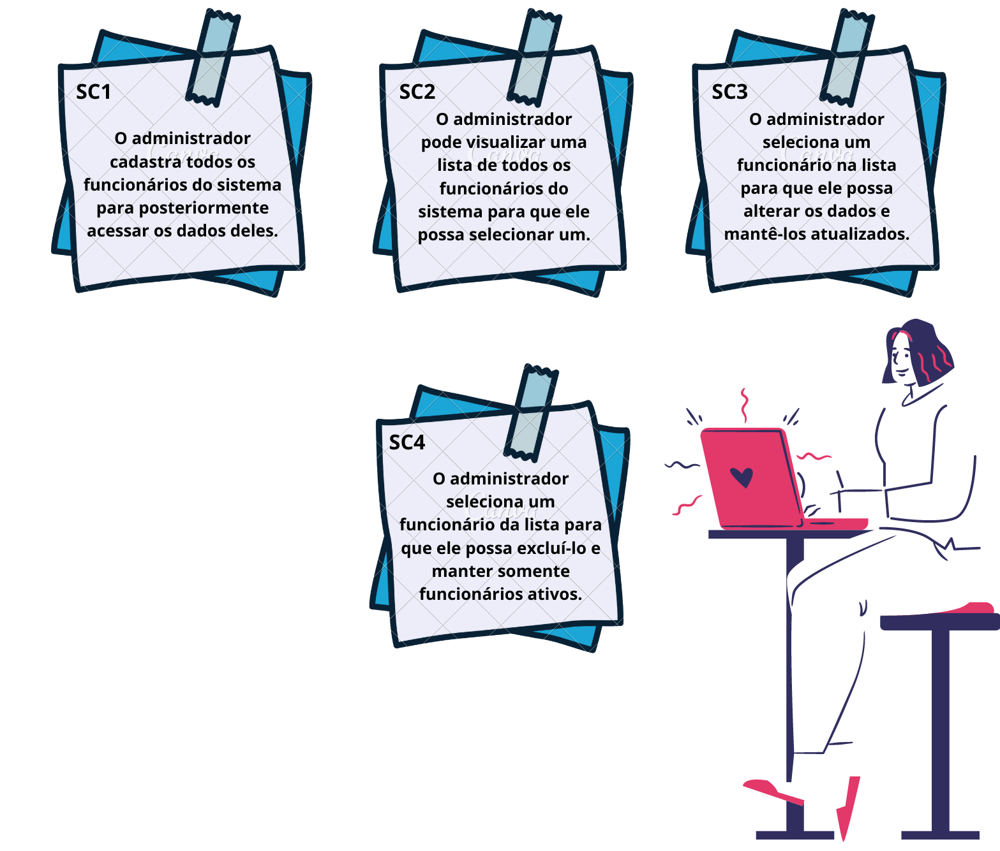
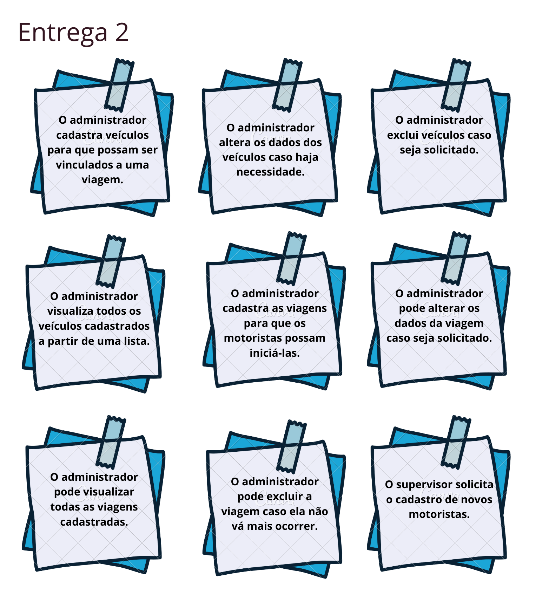
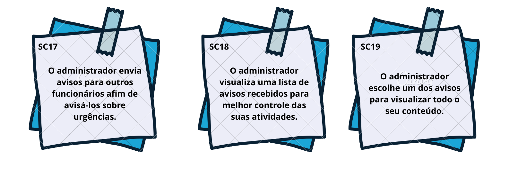
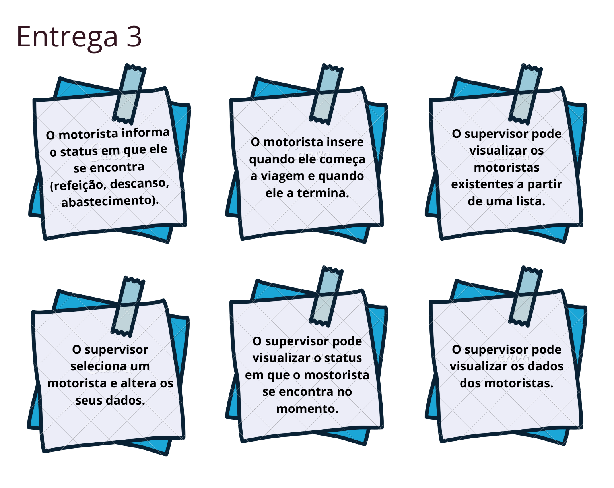
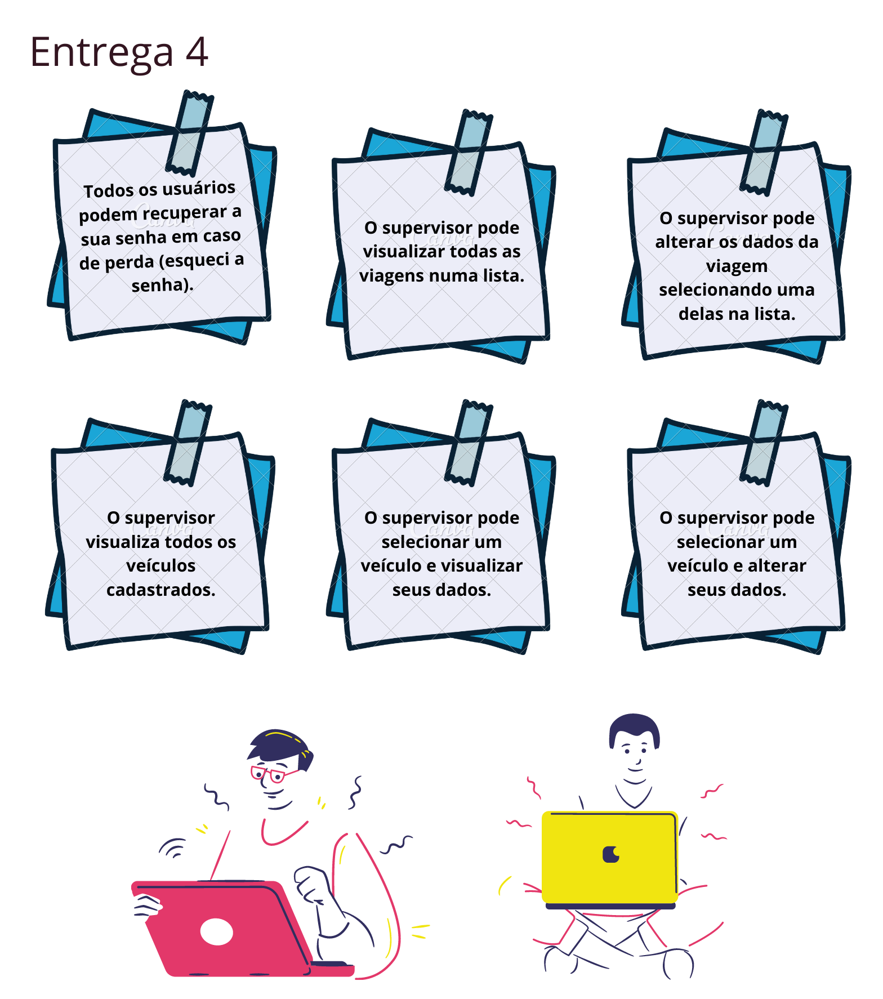
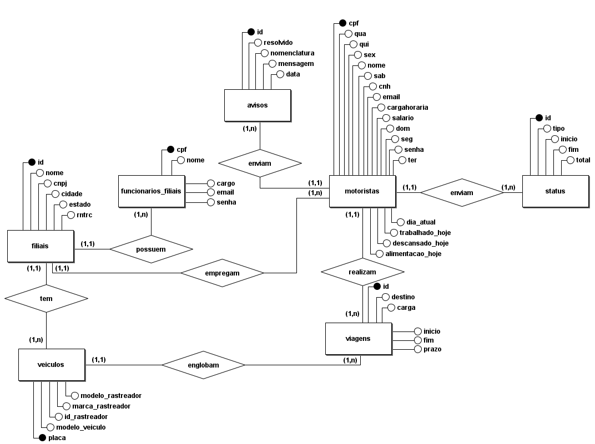
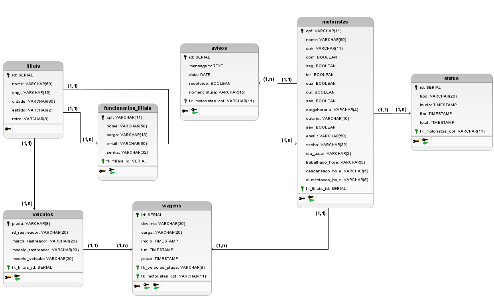

<head>
       

       

       

       
       
       
       
       

         
</head>
<body>
        <nav>
            
<h1>RoadTracker :truck::computer:</h1>

            
Seja bem vindo ao repositório do RoadTracker!

            
<h2>O nosso desafio</h2>

            
Nosso cliente é a empresa IACIT. Foi solicitado para nós desenvolver um sistema para o gerenciamento e controle da jornada de trabalho de motoristas que seja parametrizável visando à disponibilização de funcionalidades de planejamento, acompanhamento, controlando a jornada de trabalho de cada um desses colaboradores. Nosso sistema deverá oferecer um cadastro para motoristas (tendo nome, CPF, matrícula e ID do equipamento do caminhão), um cadastro para os dados do veículo (como a placa, a marca e versão do rastreador e o ID do equipamento), a escala dos motoristas (turno, carga horária, dias de trabalho e de folga), um cadastro de alertas (contendo ocorrência, sigla, ícone, descrição do alerta e regra/parâmetro) e um cadastro de status (cadastrar status e regras de negócio de acordo com cada situação ocorrida durante a jornada, ID dos macros/mensagens, status de início e fim de jornada, tempo de trabalho, espera, refeição e descanso).

<ul>
<li><a href="https://github.com/Syank/PI-JornadaDeMotoristas#o-que-%C3%A9-o-roadtracker"> O que é o RoadTracker?</a></li>
<li><a href="https://github.com/Syank/PI-JornadaDeMotoristas#integrantes-da-equipe-girlboy"> Integrantes da equipe</a></li>
       <li><a href="https://github.com/Syank/PI-JornadaDeMotoristas#Branches-de-cada-entrega">Branches de cada entrega</a></li>
<li><a href="https://github.com/Syank/PI-JornadaDeMotoristas#cards-das-sprints-entregas-do-sistema">Cards das Sprints (entregas) do sistema</a></li>
<li><a href="https://github.com/Syank/PI-JornadaDeMotoristas#nosso-sistema-em-funcionamento-at%C3%A9-o-momento">Nosso sistema em funcionamento até o momento</a></li>
<li><a href="https://github.com/Syank/PI-JornadaDeMotoristas#user-stories-do-nosso-sistema">User stories do nosso sistema</a></li>
<li><a href="https://github.com/Syank/PI-JornadaDeMotoristas#wireframes-do-roadtracker-">Wireframes do RoadTracker</a></li>
<li><a href="https://github.com/Syank/PI-JornadaDeMotoristas#modelo-conceitual-do-nosso-banco-de-dados">Modelo conceitual do nosso banco de dados</a></li>
<li><a href="https://github.com/Syank/PI-JornadaDeMotoristas#modelo-l%C3%B3gico-do-nosso-banco-de-dados">Modelo lógico do nosso banco de dados</a></li>
<li><a href="https://github.com/Syank/PI-JornadaDeMotoristas#modelo-f%C3%ADsico-do-nosso-banco-de-dados">Modelo físico do nosso banco de dados</a></li>
</ul>
</nav>
</section>

<section id="o_que_e">
            <h3>O que é o RoadTracker?</h3>
            
Nosso sistema, RoadTracker, tem o objetivo de realizar o controle das jornadas de trabalho de motoristas, pois, muitas vezes, não há o monitoramento e acompanhamento necessário do expediente desses trabalhadores. Todas as filiais de uma empresa devem ser cadastradas, assim como seus motoristas e suas respectivas jornadas de trabalho, viagens a serem realizadas e o veículo que será utilizado em cada uma dessas viagens. Além disso, a filial terá acesso a várias informações sobre o status do motorista durante a viagem!

               
</section>

<section id="integrantes">
            <h3>Integrantes da equipe :girl::boy:</h3>
       <ul>
            <li>
<a href="https://www.linkedin.com/in/rafael-furtado-613a9712a/" target = "_blank">Rafael Furtado Rodrigues dos Santos</a>  (Scrum Master)

            <li>
<a href="https://www.linkedin.com/in/b%C3%A1rbara-port-402158198/" target = "_blank">Bárbara dos Santos Port</a> (Product Owner)

            <li>
<a href="https://www.linkedin.com/in/ana-clara-godoy-2973381b2/" target = "_blank">Ana Clara Ferreira de Godoy</a> (Development Team)

            <li>
<a href="https://www.linkedin.com/in/giovanni-santos-546412154/" target = "_blank">Giovanni dos Santos Alves</a> (Development Team)

            <li>
<a href="https://www.linkedin.com/in/ana-carolina-lima-099955136/" target = "_blank">Ana Carolina da Silva Lima</a> (Development Team)

            <li>
<a href="https://www.linkedin.com/in/anna-yukimi-yamada-6ba23b149/" target = "_blank">Anna Yukimi Yamada</a> (Development Team)

       </ul>
</section>
<section id="branches_entregas">
       <h3>Branches de cada entrega</h3>
       <table>
              <thead>
                     <th width=100px>Entregas</th>
                     <th>Descrições</th>
                     <th width=215px>Datas</th>
                     <th>Links</th>
              </thead>
              <tbody>
                     <tr>
                            <td>Entrega 1</td>
                            <td>CRUD do administrador envolvendo os funcionários das filiais</td>
                            <td>07/09/2020 a 27/09/2020</td>
                            <td><a href="https://github.com/Syank/PI-JornadaDeMotoristas/tree/sprint_0">Visualizar</td>
                     </tr>
                     <tr>
                            <td>Entrega 2</td>
                            <td>CRUD do administrador englobando filiais, veículos e viagens. Leitura de avisos por parte dos supervisores e administradores.</td>
                            <td>28/09/2020 a 18/10/2020</td>
                            <td><a href="https://github.com/Syank/PI-JornadaDeMotoristas/tree/sprint_1">Visualizar</td>
                     </tr>
                     <tr>
                            <td>Entrega 3</td>
                            <td>O motorista poderá inserir dados sobre a viagem e o supervisor poderá visualizar e alterar dados dos motoristas.</td>
                            <td>19/10/2020 a 08/11/2020</td>
                            <td>Em breve</td>
                     </tr>
                      <tr>
                            <td>Entrega 4</td>
                            <td>O supervisor poderá visualizar e alterar dados dos veículos e viagens. Todos os usuários poderão recuperar suas senhas.</td>
                            <td>09/11/2020 a 29/11/2020</td>
                            <td>Em breve</td>
                     </tr>
              </tbody>
       </table>
       <h4><a href="https://docs.google.com/spreadsheets/d/1HuQ9GrWlmToOBW_bJGg-9X_d5m0Zey0G/edit#gid=1949042978">Visualizar <i>burndown</i> de cada sprint</h4>
</section>

<section id="cards">
       <h3><i>Cards</i> das <i>sprints</i> (entregas) do sistema</h3>
       <h4>Primeira entrega :clock12:</h4>
       
Os funcionários são os principais agentes do sistema. Dentre eles destaca-se o motorista. Sendo assim, vimos a oportunidade de impressionar aqueles que estivessem utilizando o sistema para administrar as informações da empresa e dos funcionários. Oferecemos uma interface intuitiva que permite ao administrador organizar as informações dos funcionários das filiais em um único local, disponibilizar os dados destes para o melhor conhecimento e o controle das atividades de cada colaborador presente nessas filiais. O usuário administrador é capaz de atualizar essas informações a qualquer momento de forma dinâmica e simplificada. Quantidade de story cards restantes: 29.

       
       <h4>Segunda entrega :clock4:</h4>
       
O projeto pode ser basicamente separado em três partes, de acordo com os perfis de acesso: motorista, supervisor e administrador. Como a entrega anterior focava no perfil do administrador, optamos, para a sprint 1, por finalizar todas as funcionalidades deste perfil. Sendo assim, o usuário já pode ter uma experiência de uso mais concreta do nosso sistema, podendo cadastrar todas as entidades, acessar as informações de outros usuários, editá-las ou apagá-las, se assim desejar. As funcionalidades do administrador são a base para as atividades do supervisor e do motorista. Devido a isso, é necessário concluir todas as funcionalidades do perfil administrador primeiro, pois sem um administrador não há filial, sem filial não é possível cadastrar veículos e outros funcionários, sem funcionários não há viagens, e assim por diante. Para que as próximas entregas sejam coesas, é preciso que já existam os cadastros das entidades que são imprescindíveis na realização de uma viagem. Quantidade de story cards restantes: 14 

       
       <h4>Terceira entrega :clock8:</h4>
       
Com toda a parte fundamental para a criação de uma viagem finalizada, é hora de implementar a principal parte do sistema: a inserção de dados do andamento da viagem através do motorista. Este poderá informar os status da sua jornada de trabalho, definir o momento em que ele deu início à viagem, o horário que parou para almoçar, descansar ou abastecer, assim como quando retornou desta pausa e quando concluiu sua viagem. Como o motorista terá boa parte das suas funcionalidades nesta entrega, serão criadas também, as as atividades de um novo tipo de usuário: o supervisor. Adicionaremos o básico das suas funcionalidades com o intuito de facilitar o acesso aos dados, caso algum administrador esteja ausente. Desta forma, o sistema estará englobando boa parte do processo de gerenciamento e acompanhamento das jornadas.

       
       <h4>Quarta entrega :clock12:</h4>
       
Todas as funcionalidades do supervisor estarão presentes no sistema, proporcionando uma melhor experiência para os três diferentes níveis de acesso. Caso um administrador não possa resolver algo no momento, um supervisor poderá solicitar o cadastro (caso esse seja o caso) ou ele mesmo poderá alterar e visualizar os dados sobre viagens e motoristas presentes no sistema. Como forma de manter o acesso de todos os usuários ao sistema, todos poderão recuperar suas senhas através da interface, sem depender de cargos superiores para realizar esse tipo de alteração. Sendo assim todo o nosso sistema estará consolidado em todas as partes. Além disso, serão feitos ajustes finais para melhorar ainda mais a expreriência do usuário.

       
</section>
    
<section id="sistema_ate_o_momento">
        <h3>Nosso sistema em funcionamento até o momento</h3>
        
</section>
    

<section id="user_stories">
     <h3>User stories do nosso sistema</h3>
     <h4>Primeira entrega :clock12:</h4>
     
A nossa primeira entrega contará com um CRUD dos funcionários das filiais, que poderão ter os cargos de administrador, supervisor e motorista. A partir disso, as filiais já poderão ter controle dos funcionários cadastrados sob seu nome e terão uma visão mais ampla das jornadas de trabalho de cada colaborador.

    
     <h4>Segunda entrega :clock4:</h4>
    
Na segunda entrega já será possível o cadastro das filiais, assim como dos veículos e viagens. Isso possibilitará o melhor controle de cada viagem realizada, disponibilizando informaçoes do veículo nela utilizado, o motorista que a realizará e proporcionando a escalabilidade de boa parte do sistema.

    
    
     <h4>Terceira entrega :clock8:</h4>
     
Acerca da terceira entrega, o motorista poderá cadastrar os status em que ele se encontra (como descanso, espera, alimentação e abastecimento), permitindo que todos da sua filial saibam como está o andamento de sua viagem. Essa é uma das principais funcionalidades do sistema, porém depende de outra: cadastro das viagens. Sem uma viagem o motorista não poderá emitir status.

    
     <h4>Quarta entrega :clock12:</h4>
     
Finalmente, diante da quarta e última entrega, todos os usuários poderão recuperar a sua senha caso seja necessário. Haverá um perfil para supervisores, que poderão desempenhar algumas funções dos administradores (o que ajuda na agilidade dos processos). Além disso, os motoristas poderão enviar avisos aos administradores e supervisores, caso haja algum assunto importante a ser tratado ou caso ocorra alguma emergência.

    
</section>
          

<section id="Wireframes">
    <h3>Wireframes do RoadTracker </h3>
        

    
    
       

        

               
                
       

        

               
               
        

        

          
       

       <h4><a href="https://github.com/Syank/PI-JornadaDeMotoristas/tree/master/doc/wireframes">Visualizar todos os <i>wireframes</i> do sistema</a></h4>
 </section>

<section id="ModeloC">
        <h3>Modelo conceitual do nosso banco de dados</h3>
        
    
</section>

<section id="ModeloL">
        <h3>Modelo lógico do nosso banco de dados</h3>
        

</section>
</body>
<section id="ModeloF">
        <h3>Modelo físico do nosso banco de dados</h3>
        </section>

~~~SQL

CREATE DATABASE rtracker;

CREATE TABLE filiais (
    id SERIAL PRIMARY KEY,
    nome VARCHAR(50),
    cnpj VARCHAR(15),
    cidade VARCHAR(30),
    estado VARCHAR(2),
    rntrc VARCHAR(8)
);

CREATE TABLE funcionarios_filiais (
    cpf VARCHAR(11) PRIMARY KEY,
    nome VARCHAR(50),
    cargo VARCHAR(13),
    email VARCHAR(50),
    senha VARCHAR(32),
    fk_filiais_id SERIAL
);

CREATE TABLE motoristas (
    cpf VARCHAR(11) PRIMARY KEY,
    nome VARCHAR(50),
    cnh VARCHAR(11),
    dom BOOLEAN,
    seg BOOLEAN,
    ter BOOLEAN,
    qua BOOLEAN,
    qui BOOLEAN,
    sab BOOLEAN,
    cargahoraria VARCHAR(4),
    salario VARCHAR(10),
    sex BOOLEAN,
    email VARCHAR(50),
    senha VARCHAR(32),
    dia_atual VARCHAR(2),
    trabalhado_hoje VARCHAR(5),
    descansado_hoje VARCHAR(5),
    alimentacao_hoje VARCHAR(5),
    fk_filiais_id SERIAL
);

CREATE TABLE avisos (
    id SERIAL PRIMARY KEY,
    mensagem TEXT,
    data DATE,
    resolvido BOOLEAN,
    nomenclatura VARCHAR(15),
    fk_motoristas_cpf VARCHAR(11)
);

CREATE TABLE veiculos (
    placa VARCHAR(8) PRIMARY KEY,
    id_rastreador VARCHAR(20),
    marca_rastreador VARCHAR(20),
    modelo_rastreador VARCHAR(20),
    modelo_veiculo VARCHAR(20),
    fk_filiais_id SERIAL
);

CREATE TABLE viagens (
    id SERIAL PRIMARY KEY,
    destino VARCHAR(30),
    carga VARCHAR(20),
    inicio TIMESTAMP,
    fim TIMESTAMP,
    prazo TIMESTAMP,
    fk_veiculos_placa VARCHAR(8),
    fk_motoristas_cpf VARCHAR(11)
);

CREATE TABLE status (
    id SERIAL PRIMARY KEY,
    tipo VARCHAR(20),
    inicio TIMESTAMP,
    fim TIMESTAMP,
    total TIMESTAMP,
    fk_motoristas_cpf VARCHAR(11)
);
 
ALTER TABLE funcionarios_filiais ADD CONSTRAINT FK_funcionarios_filiais_2
    FOREIGN KEY (fk_filiais_id)
    REFERENCES filiais (id)
    ON DELETE RESTRICT;
 
ALTER TABLE motoristas ADD CONSTRAINT FK_motoristas_2
    FOREIGN KEY (fk_filiais_id)
    REFERENCES filiais (id)
    ON DELETE RESTRICT;
 
ALTER TABLE avisos ADD CONSTRAINT FK_avisos_2
    FOREIGN KEY (fk_motoristas_cpf)
    REFERENCES motoristas (cpf)
    ON DELETE RESTRICT;
 
ALTER TABLE veiculos ADD CONSTRAINT FK_veiculos_2
    FOREIGN KEY (fk_filiais_id)
    REFERENCES filiais (id)
    ON DELETE RESTRICT;
 
ALTER TABLE viagens ADD CONSTRAINT FK_viagens_2
    FOREIGN KEY (fk_veiculos_placa)
    REFERENCES veiculos (placa)
    ON DELETE RESTRICT;
 
ALTER TABLE viagens ADD CONSTRAINT FK_viagens_3
    FOREIGN KEY (fk_motoristas_cpf)
    REFERENCES motoristas (cpf)
    ON DELETE RESTRICT;
 
ALTER TABLE status ADD CONSTRAINT FK_status_2
    FOREIGN KEY (fk_motoristas_cpf)
    REFERENCES motoristas (cpf)
    ON DELETE RESTRICT;

~~~
