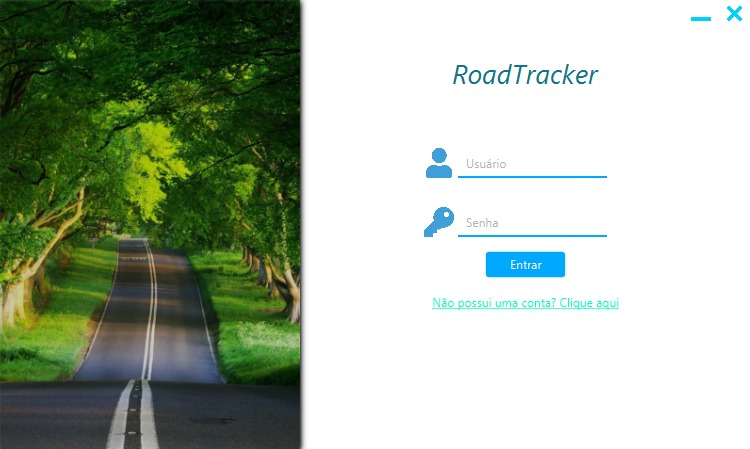
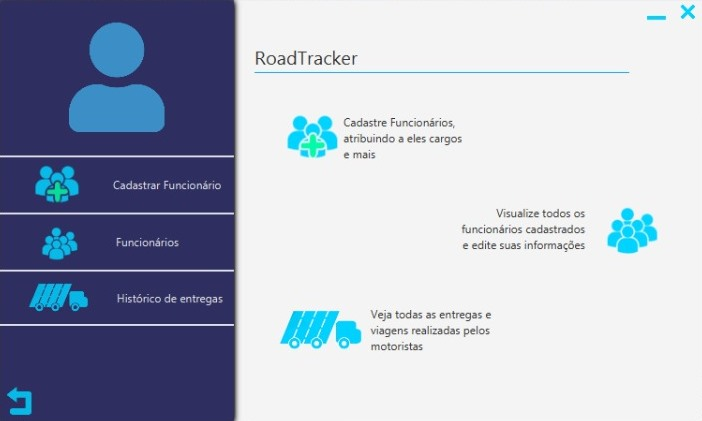
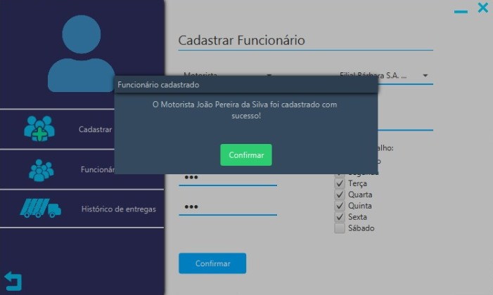
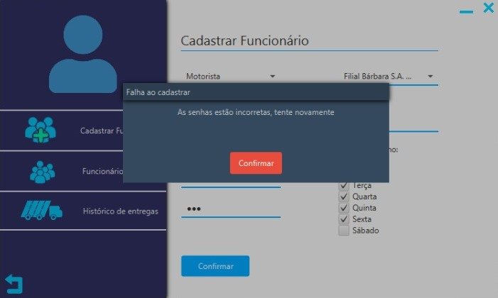
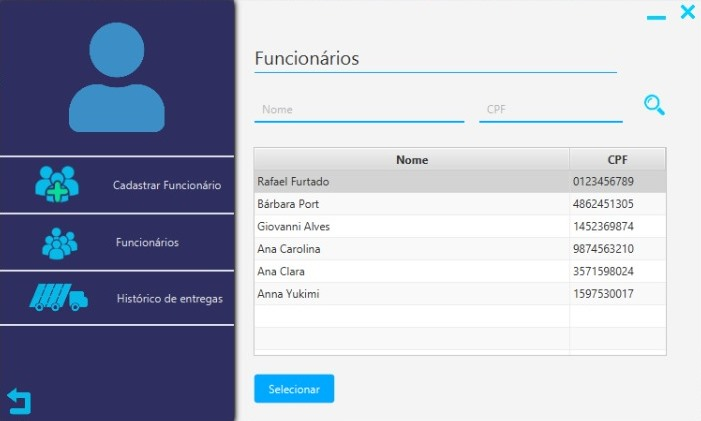
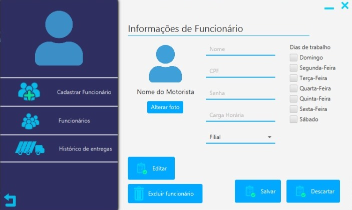
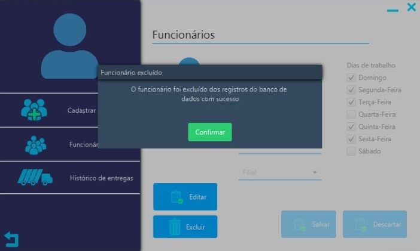
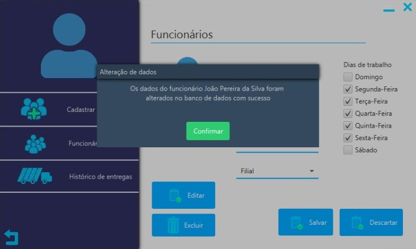
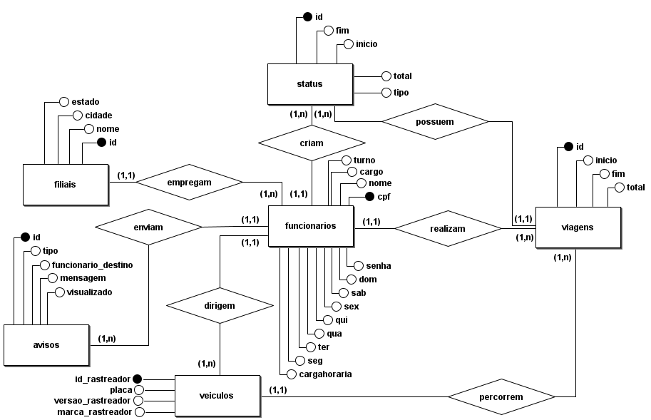
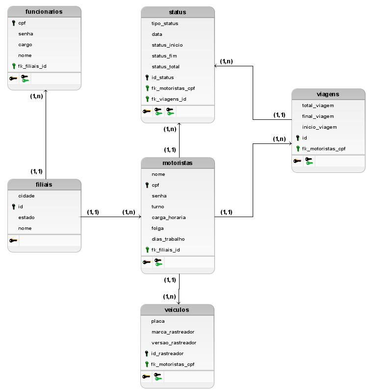

<head>
       

        

       

        
        
        
        
       

         
</head>
<body>
        <nav>
            
<h1># RoadTracker :truck::computer:</h1>

            
Seja bem vindo ao repositório do RoadTracker!

            
<h3>## O nosso desafio </h3>

            
Nosso cliente é a empresa IACIT e nos foi solicitado para desenvolver um sistema de gerenciamento de controle de jornada de trabalho de motoristas de forma parametrizável visando a disponibilização de funcionalidades de planejamento, acompanhamento e controle da jornada de trabalho destes trabalhadores. Nosso sistema deverá oferecer cadastro para motoristas (tendo nome, CPF, matrícula e ID do equipamento do caminhão), um cadastro para os dados do veículo (como a placa, a marca e versão do rastreador e o ID do equipamento), escala dos motoristas (turno, carga horária, dias de trabalho e de folga), um cadastro de alertas (contendo ocorrência, sigla, ícone, descrição do alerta e regra/parâmetro), cadastro de status (cadastrar status e regras de negócio de acordo com cada situação ocorrida durante a jornada, ID dos macros/mensagens, status de início e fim de jornada, tempo de trabalho, tempo de espera, tempo de refeição e tempo de descanso).

    <ul>
<li><a href="https://github.com/Syank/PI-JornadaDeMotoristas#-o-que-%C3%A9-o-roadtracker">## O que é o RoadTracker?</a></li>

<li><a href="https://github.com/Syank/PI-JornadaDeMotoristas#-integrantes-da-equipe-girlboy">## Integrantes da equipe</a></li>

<li><a href="https://github.com/Syank/PI-JornadaDeMotoristas#-cards-das-sprintsentregas-do-sistema">## Cards das Sprints(entregas) do sistema</a></li>

<li><a href="https://github.com/Syank/PI-JornadaDeMotoristas#nosso-sistema-em-funcionamento-at%C3%A9-o-momento">##Nosso sistema em funcionamento até o momento</a></li>

<li><a href="https://github.com/Syank/PI-JornadaDeMotoristas#-user-stories-do-nosso-sistema">## User stories do nosso sistema</a></li>

<li><a href="https://github.com/Syank/PI-JornadaDeMotoristas#-wireframes-do-roadtracker-">## Wireframes do RoadTracker</a></li>

<li><a href="https://github.com/Syank/PI-JornadaDeMotoristas#modelo-conceitual-do-nosso-banco-de-dados">## Modelo conceitual do nosso banco de dados</a></li>

<li><a href="https://github.com/Syank/PI-JornadaDeMotoristas#modelo-l%C3%B3gico-do-nosso-banco-de-dados">## Modelo lógico do nosso banco de dados</a></li>

<li><a href="https://github.com/Syank/PI-JornadaDeMotoristas#modelo-f%C3%ADsico-do-nosso-banco-de-dados">## Modelo físico do nosso banco de dados</a></li>

<li><a href="https://github.com/Syank/PI-JornadaDeMotoristas#vers%C3%B5es-das-bibliotecas-utilizadas-por-n%C3%B3s">## Versões das bibliotecas utilizadas por nós</a></li>

  </ul>
</nav>
</section>

<section id="O que é">
            <h3>## O que é o RoadTracker?</h3>
            
Nosso sistema, RoadTracker, tem o objetivo de realizar o controle das jornadas de trabalho de motoristas, pois muitas vezes não há o controle sobre o expediente desses trabalhadores. Todas as filiais de uma empresa ser cadastradas e realizar o cadastro de seus motoristas e, consequentemente, realizar o cadastro das jornadas de trabalho deles, o veículo que será utilizado e a viagem a ser realizada. Além disso, a filial terá acesso a várias informações sobre o status do motorista durante a viagem!

               
</section>

<section id="Integrantes">
            <h3>## Integrantes da equipe :girl::boy:</h3>
            
<a href="https://www.linkedin.com/in/rafael-furtado-613a9712a/" target = "_blank">Rafael Furtado Rodrigues dos Santos (Scrum Master)</a>

            
<a href="https://www.linkedin.com/in/b%C3%A1rbara-port-402158198/" target = "_blank">Bárbara dos Santos Port (Product Owner)</a>

            
<a href="https://www.linkedin.com/in/ana-clara-godoy-2973381b2/" target = "_blank">Ana Clara Ferreira de Godoy (Development Team)</a>

            
<a href="https://www.linkedin.com/in/giovanni-santos-546412154/" target = "_blank">Giovanni dos Santos Alves (Development Team)</a>

            
<a href="https://www.linkedin.com/in/ana-carolina-lima-099955136/" target = "_blank">Ana Carolina da Silva Lima (Development Team)</a>

            
<a href="https://www.linkedin.com/in/anna-yukimi-yamada-6ba23b149/" target = "_blank">Anna Yukimi Yamada (Development Team)</a>

               
</section>
<section id="cards">
        <h3>## Cards das Sprints(entregas) do sistema</h3>
        
   </section>
    
<section id="sistema_ate_o_momento">
        <h3>##Nosso sistema em funcionamento até o momento</h3>
        
        
   </section>
    

<section id="User stories">
     <h3>## User stories do nosso sistema</h3>
     <h4>### Primeira entrega :clock12:</h4>
     
A nossa primeira entrega contará com um CRUD dos funcionários das filais, que poderão ter os cargos de administrador, supervisor e motoristas. Sendo assim as filiais já poderão ter controle dos funcionários que estarão cadastrados e já poderão ter uma visão melhor sobre as jornadas de trabalho de cada funcionário.

    
     <h4>### Segunda entrega :clock4:</h4>
    
Na segunda entrega já será possível o cadastro de filiais, de veículos e viagens. Isso já possibilita o controle dos veículos e as viagens realizadas, proporcionando a escalabilidade de boa parte do sistema.

    
     <h4>### Terceira entrega :clock8:</h4>
     
Acerca da terceira entrega o motorista cadastrar os status em que ele se encontra (como descanso, espera, alimentação e abastecimento), podendo informar a todos da sua filial sobre qual o seu estado. Essa é uma das principais funcionalidades do sistema, porém depende de outra: cadastro das viagens. Sem uma viagem o motorista não poderá emitir status.

    
     <h4>### Quarta entrega :clock12:</h4>
     
Finalmente, diante da quarta e última entrega, todos os usuários poderão recuperar a sua senha caso seja necessário. Haverá um perfil para supervisores, que poderão desempenhar algumas funções dos administradores (o que ajuda na agilidade dos processos). Além disso os funcionários poderão enviar avisos a outros funcionários, caso haja algum assunto importante a ser tratado ou caso ocorra alguma emergência.

    
</section>
          

<section id="Wireframes">
    <h3>## Wireframes do RoadTracker </h3>
        

    
       

        

                
       
       

        

               
    
        

        

    
    
       

        

    
    
       

    
 </section>

<section id="ModeloC">
        <h3>Modelo conceitual do nosso banco de dados</h3>
        
    
</section>

<section id="ModeloL">
        <h3>Modelo lógico do nosso banco de dados</h3>
        

</section>
</body>
<section id="ModeloF">
        <h3>Modelo físico do nosso banco de dados</h3>
        </section>

~~~SQL

CREATE DATABASE rtracker;

CREATE TABLE filiais (
    cidade VARCHAR(50),
    id SERIAL PRIMARY KEY,
    estado VARCHAR(2),
    nome VARCHAR(50)
);

CREATE TABLE funcionarios (
    cargo VARCHAR(20),
    senha VARCHAR(64),
    cpf VARCHAR(11) PRIMARY KEY,
    dom BOOLEAN,
    sab BOOLEAN,
    sex BOOLEAN,
    qui BOOLEAN,
    ter BOOLEAN,
    cargahoraria VARCHAR(3),
    seg BOOLEAN,
    nome VARCHAR(50),
    qua BOOLEAN,
    turno VARCHAR(10),
    fk_filiais_id SERIAL
);

CREATE TABLE veiculos (
    placa VARCHAR(10),
    versao_rastreador VARCHAR(20),
    id_rastreador VARCHAR(30) PRIMARY KEY,
    marca_rastreador VARCHAR(20),
    fk_funcionarios_cpf VARCHAR(11)
);

CREATE TABLE status (
    tipo VARCHAR(20),
    inicio DATETIME,
    fim DATETIME,
    total TIMESTAMP,
    id SERIAL PRIMARY KEY,
    fk_funcionarios_cpf VARCHAR(11),
    fk_viagens_id SERIAL
);

CREATE TABLE viagens (
    total TIMESTAMP,
    fim DATETIME,
    inicio DATETIME,
    id SERIAL PRIMARY KEY,
    fk_funcionarios_cpf VARCHAR(11),
    fk_veiculos_id_rastreador VARCHAR(30)
);

CREATE TABLE avisos (
    id SERIAL PRIMARY KEY,
    tipo VARCHAR(20),
    funcionario_destino VARCHAR(11),
    mensagem TEXT,
    visualizado BOOLEAN,
    fk_funcionarios_cpf VARCHAR(11)
);
 
ALTER TABLE veiculos ADD CONSTRAINT FK_veiculos_2
    FOREIGN KEY (fk_funcionarios_cpf)
    REFERENCES funcionarios (cpf)
    ON DELETE RESTRICT;
 
ALTER TABLE status ADD CONSTRAINT FK_status_2
    FOREIGN KEY (fk_funcionarios_cpf)
    REFERENCES funcionarios (cpf)
    ON DELETE RESTRICT;
 
ALTER TABLE status ADD CONSTRAINT FK_status_3
    FOREIGN KEY (fk_viagens_id)
    REFERENCES viagens (id)
    ON DELETE RESTRICT;
 
ALTER TABLE funcionarios ADD CONSTRAINT FK_funcionarios_2
    FOREIGN KEY (fk_filiais_id)
    REFERENCES filiais (id)
    ON DELETE RESTRICT;
 
ALTER TABLE viagens ADD CONSTRAINT FK_viagens_2
    FOREIGN KEY (fk_funcionarios_cpf)
    REFERENCES funcionarios (cpf)
    ON DELETE RESTRICT;
 
ALTER TABLE viagens ADD CONSTRAINT FK_viagens_3
    FOREIGN KEY (fk_veiculos_id_rastreador)
    REFERENCES veiculos (id_rastreador)
    ON DELETE RESTRICT;
 
ALTER TABLE avisos ADD CONSTRAINT FK_avisos_2
    FOREIGN KEY (fk_funcionarios_cpf)
    REFERENCES funcionarios (cpf)
    ON DELETE RESTRICT;

~~~

<section id="versoes">
    <ul>
<h3>Versões das bibliotecas utilizadas por nós</h3>
<li>
- JavaFX: 14.0.2.1
</li>
<li>
- JDK: 14.0.2.1
</li>
<li>
- Hibernate: 5.4.21
</li>
<li>
- PostgreSQL JDBC: 42.2.16
</li>
   </ul>
</section>
